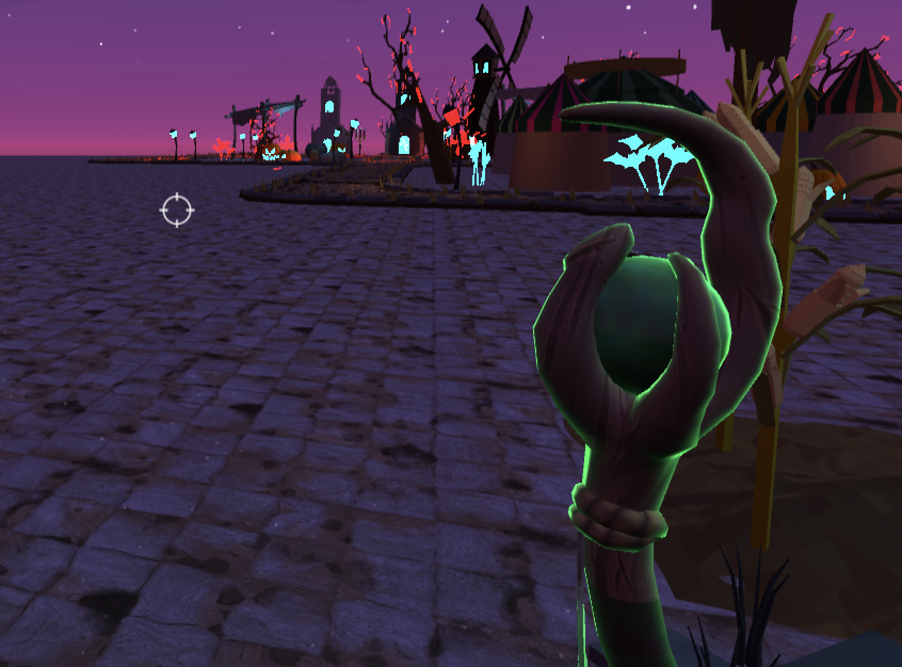

**The University of Melbourne**

# COMP30019 – Graphics and Interaction

<!-- [[EndTeamworkPlan]] PLEASE LEAVE THIS LINE UNTOUCHED -->

## Final report

**Halloween Nightmare** is a first-person shooter game of a semester-long project for the subject Graphics and Interaction(COMP30019). This is completed by a team of four with Unity. 

This subject introduces the technologies of computer graphics and human-computer interaction along with the biological, psychological and social aspects of human perception and action that inform the application of those technologies. 

The purpose of this report is to outline our game development process. It is divided into four aspects: introduction of the game, technologies used, evaluation and external references and resources. 

Please refer to the table of contents below for more information. 

### Table of contents

- [1. Game introduction](#1-game-introduction)
    - [1.1 Game summary](#11-game-summary)
    - [1.2 How to play the game](#12-how-to-play-the-game)
    - [1.3 Gameplay design decisions](#13-gameplay-design-decisions)

- [2. Technologies](#2-technologies)
    - [2.1 Version](#21-version)
    - [2.2 Objects and entities modeling](#22-objects-and-entities-modeling)
        - [2.2.1 Camera motion](#221-camera-motion)
        - [2.2.2 Main character modeling](#222-main-character-modeling)
        - [2.2.3 Enemy modeling](#223-enemy-modeling)
    - [2.3 Graphic pipeline (Shader)](#23-graphic-pipeline-shader)
        - [2.3.1 Path](#231-path)
        - [2.3.2 Water floor shader](#232-water-floor-shader)
        - [2.3.3 Skeleton shader](#233-skeleton-shader)
    - [2.4 Procedural generation technique/algorithm](#24-procedural-generation-techniquealgorithm)
        - [2.4.1 Terrain](#241-terrain)
        - [2.4.2 Enemy](#242-enemy)
    - [2.5 Particle system](#25-particle-system)
        - [2.5.1 Path](#251-path)
        - [2.5.2 Firefly](#252-firefly)
        - [2.5.3 Fire](#253-fire)

- [3. Evaluation](#3-evaluation)
    - [3.1 Evaluation description and methodology](#31-evaluation-description-and-methodology)
    - [3.2 Questionnaire template](#32-questionnaire-template)
        - [3.2.1 Summary](#321-summary)
        - [3.2.2 Consent](#322-consent)
        - [3.2.3 Pre-test questionnaire](#323-pre-test-questionnaire)
        - [3.2.4 Cognitive walkthrough](#324-cognitive-walkthrough)
        - [3.2.5 Post-test questionnaire](#325-post-test-questionnaire)
    - [3.3 Evaluation feedbacks](#33-evaluation-feedbacks)
    - [3.4 Evaluation modifications](#34-evaluation-modifications)

- [4. Reference and external resources](#4-reference-and-external-resources)

<!-- Game Intro -->
## 1. Game introduction

- [1.1 Game summary](#11-game-summary)
- [1.2 How to play the game](#12-how-to-play-the-game)
- [1.3 Gameplay design decisions](#13-gameplay-design-decisions)

### 1.1 Game summary

Halloween Nightmare is a first-person shooter (FPS) set in the Dark Wizard World. 
Diagon Alley is a dark and seedy alley which is frequently populated by Dark Wizards. There are also dark wizard stores, terrifying graveyards, frightening ghosts and dangerous skeletons here.
Player has to kill all skeletons by the wand in the game to escape and win the game. 

### 1.2 How to play the game

- [Menu operations](#format)
   - Press **Play** to start the game.
   - Press **Quit** to quit the game.
   - Press the **ESC key** to pause the game.
   - Press **Resume** to resume the game.
   - Press **Options** to switch on/off the audio.
   - Press **Back To Main** to return to the main menu. 

- [In-game operations](#format)
   - Move the **mouse** to adjust the field of view.
   - Press the **WASD keys** to move yourself.
   - Press the **Q key** to swtich between the skills.
   - Click the **right mouse** to release the skill.

 - Build Settings
    - StartScene (level 0)
    - Scenes/gameplay 1 (level 1)

### 1.3 Gameplay design decisions

We initially planned to make a third-person game. Players would be able to attack the enemies by boxing.
However, we ended up with a first-person game. Players would be able to attack the enemies by shooting with a wand.

- [Low poly](#format)
Taking into account the limited resources and affordability of the player's CPU, we finally chose a low poly game.

- [First-person perspective](#format)
After reading countless tutorials and making code changes, we found it challenging to debug a third-person game because we had absolutely no experience with C# and 3D games. As a result, we adjusted our plan to make a first-person perspective game instead.

- [Shooting](#format)
Having looked at many resources, we realized that there are very few ones available for boxing. It left us without a clue where to begin boxing. However, we found plenty of tutorials for shooting games while searching. Therefore, We switched boxing to shooting as it would give us better access to resources and tutorials.

- [No character animation (Wand only)](#format)
We had difficulty finding the appropriate first-person character animations that fit into our game. Therefore, we decided only to use the wand as it is more suitable for the magic world theme.

<!-- Technologies -->
## 2. Technologies

- [2.1 Version](#21-version)
- [2.2 Objects and entities modeling](#22-objects-and-entities-modeling)
    - [2.2.1 Camera motion](#221-camera-motion)
    - [2.2.2 Main character modeling](#222-main-character-modeling)
    - [2.2.3 Enemy modeling](#223-enemy-modeling)
- [2.3 Graphic pipeline (Shader)](#23-graphic-pipeline-shader)
    - [2.3.1 Path](#231-path)
    - [2.3.2 Water floor shader](#232-water-floor-shader)
    - [2.3.3 Skeleton shader](#233-skeleton-shader)
- [2.4 Procedural generation technique/algorithm](#24-procedural-generation-techniquealgorithm)
    - [2.4.1 Terrain](#241-terrain)
    - [2.4.2 Enemy](#242-enemy)
- [2.5 Particle system](#25-particle-system)
    - [2.5.1 Path](#251-path)
    - [2.5.2 Firefly](#252-firefly)
    - [2.5.3 Fire](#253-fire)

## 2.1 Version

Project is created with:

- Unity 2022.1.9f1
- Ipsum version: 2.33
- Ament library version: 999

## 2.2 Objects and entities modeling

### 2.2.1 Camera motion

- [FPS camera](#format)
Since this is a first-person camera, the camera is diagonally positioned on the character's left shoulder after experimenting with some positions. Firstly, it can capture the prefab of the weapon properly. Secondly, it can operate without any modeling issues. For example, one of the camera positions attempted resembles observing from the inside of the character's body. Thirdly, it can perfectly simulate the vision of a character.

### 2.2.2 Main Character Modeling

- [Basic movement logic](#format)
Firstly, all motion behaviors are located in the function "FixedUpdate()" to avoid collision jitter. Secondly, if the character has collisions with obstacles, the moving speed of the character will be decreased to 1.0f to avoid across the model. Thirdly, "GetAxisRow()" function is used to retrieve a player's keyboard and mouse input to carry out the movement of characters and cameras.

- [Animation control](#format)
Firstly, the animator is used to control the animations. Secondly, an IK controller is utilized to allow the character to hold the weapon. This makes shading more realistic. Thirdly, only the animations "At Rest", "Run", "Jump", "Dead" and "Fall Down" are applied in the game due to limited resources.

- [Attack](#format)
The main character is able to unleash two different magic attack skills. Players can press the Q key to switch between the attack skills.

### 2.2.3 Enemy modeling

- [Model](#format)
Please refer to the external resource for more information.

- [Artificial Intelligence](#format)
To begin with, the map is baked by the Unit Navigation System. Next, an enum list is created with all states of the enemies: [wander,chase,attack,dead]. 
   - In a wandering state, an enemy walks at random within a certain range and can enter the "chase state" by seeing the player or too close to the player. 
A game object is created in the position of the enemy's eye to simulate the eye. The mathematical computation of the "enemy sensor" script verifies whether the enemy can see the player.
In addition, if the player is too close to the enemy, it can find the player as well. It also enters the "chase state" even if it does not see the player. This is determined by the "soundRange()" in "enemySensor" script.
   - In a chasing state, the enemy pursues the player. It is able to automatically find its path to the player through the navigation system. 
   - In an attacking state, the enemy attacks the player. If the player is in the attack range, the enemy will enter "attack state" and perform attacks regarding the attack animation.
   - In a dead state, the enemy is killed and eliminated from the game. This occurs when the enemy's health is less than or equal to zero.

## 2.3 Graphic pipeline (Shader)

Throughout the project, there are four customized shaders written for the purpose of better visual effect as well as better optimisation when it comes to rendering.

### 2.3.1 Path

The folder **Assets/Shaders** shows all four custom shaders that are used, and the selected shaders for marking are:
- Assets/Shaders/waterFloor.shader
- Assets/Shaders/skeleton.shader

### 2.3.2 Water floor shader

[WaterFloor.shader](#fomart) is used for the terrain ground rendering. 

Firstly, it transforms the ground of the main game scene into a surface resembling an aqueous mirror, which has the features of transparency and reflection for light sources. However, the reflection effect is not as evident as the transparent one due to the low light setting of the game scene. Secondly, it is used on the static ghosts in order to have a lucency effect. Another feature of this shader is that it can optimize the rendering by highlighting the transparent material and ignoring the background material. As a result, when the camera attaches to the ghosts, the GPU returns the foreground color rather than the background.

    

### 2.3.3 Skeleton shader

[skeleton.shader](#format) is applied on the material for the wand.

This shader is used to enhance the wand with a greater effect when it is coated in certain light conditions, such as under the light pole. It is a workaround solution for the original wand which is almost invisible in low light conditions.

    
    

## 2.4 Procedural generation technique/algorithm

### 2.4.1 Terrain

It is started by creating the Terrain object, and follows by generating the desired terrain with the "terrain_generation” script. For this script, the primary algorithm used here is "Perlin Noise". 

Firstly, two offsets are required to be defined. For each grid of the terrain, apply the "Perlin Noise" in combination with offset and depth to set the height. Secondly, each grid of the terrain will be randomized by the "Perlin Noise" so that a randomly generated map can be obtained. Thirdly, maps with various terrains can simply be generated by adjusting the "scale" and the "depth". For our game, depth is set to zero to produce a plain which is friendly for the navigation system.

### 2.4.2 Enemy

The enemies are generated automatically during a random time interval. It is accomplished by the "AutoCreateObject" script. This script can be attached to a game object and turns the object into a farm. Upon reaching the limit, this farm will not generate more enemies.

**Note:** Farming usually involves staying in a game area with a spawn point that generates endless numbers of items or enemies.

## 2.5 Particle system

### 2.5.1 Path

The folder **Assets/Prefabs** contains all the particle systems, and the selected particle system for marking is:
- Assets/Prefabs/FireFlies.prefab

### 2.5.2 Firefly

The firefly effect is completed with a pure Unity particle system. 

It has an initial size of 0.5, an initial velocity of 0 and the rate over time of 20 in “Emission”. It also has a strength of 0.5 and a frequency of 0.8 in “Noise” to achieve the random nature of the firefly movement. Firstly, a sphere shape is used to give the firefly a realistic aspect. To limit particulate matter in a small range, its radius is defined at 2.  Secondly, to simulate the color change of real fireflies relative their lifespan, the color of our fireflies would change from the initial color to a final color. It is chosen to be from light blue to dark blue to adapt to our scene. Thirdly, to simulate the change in size of the real fireflies in relation to their lifespan, a downward slope would change their sizes from big to small and eventually disappear. 

     

### 2.5.3 Fire

As the texture of the fire is derived from an external resource that already contains colors. There is only one modification to allow the color to shift from black to dark blue over the time. The final output color is a regular blue. It has a start life time of 0.7, a start speed of 5, a start size of 3, a radius of 0.00001 in "Shape" and an angle of 5 in "Shape". In combination, it enables this fire to be the desired size. The material used here is 4 x 4, as a result, the tiles in texture sheet animation have to be at x = 4 and y = 4.

    

<!-- Evaluation -->
## 3. Evaluation

- [3.1 Evaluation description and methodology](#31-evaluation-description-and-methodology)
- [3.2 Questionnaire template](#32-questionnaire-template)
    - [3.2.1 Summary](#321-summary)
    - [3.2.2 Consent](#322-consent)
    - [3.2.3 Pre-test questionnaire](#323-pre-test-questionnaire)
    - [3.2.4 Cognitive walkthrough](#324-cognitive-walkthrough)
    - [3.2.5 Post-test questionnaire](#325-post-test-questionnaire)
- [3.3 Evaluation feedbacks](#33-evaluation-feedbacks)
- [3.4 Evaluation modifications](#34-evaluation-modifications)

## 3.1 Evaluation description and methodology

### Querying methods

- Questionnaire

### Observational methods

- Cooperative evaluation 

### Participants

| **ID** | **Name** | **Gender** | **Age**  | **Background** | **Occupation** |
|---|---|---|---|---|---|
| 1 | Kang Han | Male | 18-24 | China | University of Melbourne second year student |
| 2 | Allen Zhang | Male  | 25-34 | China | IT industrial practice |
| 3 | Steven Zhao | Male | 18-24 | Australian | Student |
| 4 | Clarence Alphanso | Male | 25-34 | China | IT industrial service |
| 5 | John Zhang | Male | 18-24 | China | University of Melbourne Student |

### What did participants do

Please refer to [questionnaire template section](#32-questionnaire-template) for more information.

### How to record the data 

The questionnaire is created, handled, saved and analysed by Tencent Questionnaire. 

Participants can simply click this link to complete the questionnaire: https://wj.qq.com/s2/11025523/872c/

## 3.2 Questionnaire template

### 3.2.1 Summary

Participants are required to complete the questionnaire in four parts: 

- Firstly, they are required to read the terms and conditions specified in [consent section](#322-consent) and indicate agreement.

- Seconldy, before commencing the game, they are required to fill out the [pre-test questionnaire](#323-pre-test-questionnaire) which includes personal information and game-related preferences.

- Thridly, while playing the game, they are expected to perform 3 tasks that is specified in [cognitive walkthrough section](#324-cognitive-walkthrough). 

- Finally, after completing the game, they have to fill in the [post-test questionnaire](#325-post-test-questionnaire) to provide the overall game feedbacks.

## 3.2.2 Consent

01. Thank you for taking time to participate the game test for Halloween Nightmare!

&nbsp;&nbsp;&nbsp;&nbsp;&nbsp;&nbsp; I agree to participate in the game questionnaire conducted by the group Le Meilleur. I understand that participation in this usability study is voluntary and I agree to immediately raise any concerns or areas of discomfort during the session with the study administrator. Please tick below to indicate that you have read and you understand the information on this form and that any questions you might have about the session have been answered.

- I Agree

## 3.2.3 Pre-test questionnaire

02. Please enter your name.

&nbsp;&nbsp;&nbsp;&nbsp;_______________________________________

03. What is your gender? 

- **A.** Male
- **B.** Female

04. What is your age group?

- **A.** Under 18
- **B.** 18-24
- **C.** 25-34

05. What is your background? (For example: China)

&nbsp;&nbsp;&nbsp;&nbsp;_______________________________________

06. What is your occupation? (For example: Student)

&nbsp;&nbsp;&nbsp;&nbsp;_______________________________________

07. On average, how often do you play video games? 

- **A.** Daily
- **B.** Weekly
- **C.** Monthly
- **D.** Rarely

08. What is the platform you commonly play on for video games?

- **A.** PC
- **B.** Macbook
- **C.** Mobile
- **D.** Console
- **E.** Mixed

09. Have you paid for video games or in-game purchases?(If no, please skip to question 11)

- **A.** Yes 
- **B.** No

10. How often do you purchase video games or make in-game purchases?

- **A.** Daily
- **B.** Weekly
- **C.** Monthly
- **D.** Rarely

11. To what extent do you accept the violence in video games?

- **A.** Strongly acceptable
- **B.** Unacceptable
- **C.** Don't Mind
- **D.** Acceptable
- **E.** Strongly Acceptable

12. What is your favourite video game type?

- **A.** Sandbox (e.g. Minecraft, GTA, The Sims)
- **B.** RTS (e.g. Warcraft, Age of Empires)
- **C.** FPS, TPS (e.g. Apex, Halo, Counter-Strike)
- **D.** MOBA (e.g. Data2, LOL)
- **E.** RPG, ARPG (e.g. Skyrim, Fallout 4)
- **F.** Simulation & Sports (e.g. NBA2K)
- **G.** Action-adventure (e.g. Star Wars Jedi: Fallen Order)
- **H.** Survival & Horror (e.g. The Long Dark, Don’t Starve)
- **I.** Platformer (e.g. Cuphead, Crash Bandicoot)

13. What is your favourite video game?

&nbsp;&nbsp;&nbsp;&nbsp;&nbsp;&nbsp;&nbsp;&nbsp;_______________________________________

## 3.2.4 Cognitive walkthrough

14. Did you encounter any problems while completing the task 1?

- **Task 2 description:** Visit the graveyard
- **Frequency:** High
- **Significance:** Critical

&nbsp;&nbsp;&nbsp;&nbsp;&nbsp;&nbsp;&nbsp;&nbsp;_______________________________________

15. Did you encounter any problems while completing the task 2?

- **Task 2 description:** Use different wands to issue different magic attacks
- **Frequency:** High
- **Significance:** Critical

&nbsp;&nbsp;&nbsp;&nbsp;&nbsp;&nbsp;&nbsp;&nbsp;_______________________________________

16. Did you encounter any problems while completing the task 3?

- **Task 3 description:** Kill 20 skeletons
- **Frequency:** High
- **Significance:** Critical

&nbsp;&nbsp;&nbsp;&nbsp;&nbsp;&nbsp;&nbsp;&nbsp;_______________________________________

## 3.2.5 Post-test questionnaire

17-23. Please rate the game on the following scales:

| **Description** | **Strongly disagree** | **Somewhat disagree** | **Neither agree nor disagree** | **Somewhat agree** | **Strongly agree** |
| --- | --- | --- | --- | --- | --- |
| "I found the game objectives clear and easy to follow."  |  |  |  |  |  |
| "I found the game control intuitive and straight-forward."     |  |  |  |  |  |
| "I thought that I would need the support of an expertised person to be able to play this game."  |  |  |  |  |  |
| "I felt my device could run this game at a comfortable frame rate."   |  |  |  |  |  |
| "I thought the quality of the graphics in this game is good."    |  |  |  |  |  |
| "I would imagine that most people would learn to play the game very quickly."   |  |  |  |  |  |
| "I thought the sound effects and bgm are engaging."   |  |  |  |  |  |

24. Please let us know if there is any questions or comments.

&nbsp;&nbsp;&nbsp;&nbsp;_______________________________________

## 3.3 Evaluation feedbacks

01. Consent

02. Please enter your name.

| ID | Name |
| --- | --- |
| 5	| John Zhang |
| 4	| Clarence Alphanso |
| 3	| Steven Zhao |
| 2	| Allen Zhang |
| 1	| Kang Han |

03. What is your gender? 

04. What is your age group?

05. What is your background? (For example: China)

| ID | Background |
| --- | --- |
| 5 | China | 
| 4	| Australian |
| 3	| China |
| 2	| China |
| 1	| China |

06. What is your occupation? (For example: Student)

| ID | Occupation |
| --- | --- |
| 5 | University of Melbourne Student |
| 4	| IT industrial service |
| 3	| Student |
| 2	| IT industrial practice |
| 1	| University of Melbourne second year student |

07. On average, how often do you play video games? 

08. What is the platform you commonly play on for video games?

09. Have you paid for video games or in-game purchases?(If no, please skip to question 11)

10. How often do you purchase video games or make in-game purchases?

11. To what extent do you accept the violence in video games?

12. What is your favourite video game type?

13. What is your favourite video game?

| ID | Favourite video game |
| --- | --- |
| 5 | RDR2 |
| 4	| Apex Legends |
| 3	| CSGO |
| 2	| Resident Evil Series |
| 1	| League of Legends |

14. **Did you encounter any problems while completing the task 1? (Task 1 description: Visit the graveyard)**

- The lighting and details of the scene can be improved. For example, the general tone of the coloring can be darker instead of being such bright on the static ghost model
- None
- The scene settings are too bright, it would nicer if the lighting matched the Halloween dark scene
- There is a minor lag when walking around & close to the static object like the lamp pole or the house.
- The game scene light setting is too bright, it should be in a darker settings

15. **Did you encounter any problems while completing the task 2? (Task2: Use different wands to issue different magic attacks)**

- None
- None
- N/A
- The magic wand rendering can be brighter, but the magic effect is very nice
- The magic wand is too dark, it is nearly invisible to the player even if it is in the first-person view

16. **Did you encounter any problems while completing the task 3? (Task 3: Kill 20 skeletons)**

- The game is generally good, but the game should have a tutorial where the controlling options of the game are introduced.
- The skeleton's speed is too fast, and it was very hard to not get hit by the skeletons
- N/A
- All very good
- The skeleton moves too fast, it is hard for players to play around & interact with the game scene and game objects

17. "I found the game objectives clear and easy to follow."

18. "I found the game control intuitive and straight-forward."

19. "I thought that I would need the support of an expertised person to be able to play this game."

20. "I felt my device could run this game at a comfortable frame rate."

21. "I thought the quality of the graphics in this game is good."

22. "I would imagine that most people would learn to play the game very quickly."

23. "I thought the sound effects and bgm are engaging."

24. **Please let us know if there is any questions or comments.**

- None
- There was some lagging for the explosive magic effect
- N/A
- The bgm is too relaxed and can be a little bit spookier
- The game BGM can have some improvements, it is not matched with the current Halloween theme, and it should be scarier instead of being relaxed and pleasant.

## 3.4 Evaluation modifications

### Problem 1: Inappropriate BGM 

- **Feedbacks**
    - The bgm is too relaxed and can be a little bit spookier
    - The game BGM can have some improvements, it is not matched with the current Halloween theme, and it should be scarier instead of being relaxed and pleasant.

- **Modifications made**
    - Switched the background musice to a scarier one.

### Problem 2: Wand invisible in certain light conditions

- **Feedbacks**
    - The magic wand rendering can be brighter, but the magic effect is very nice
    - The magic wand is too dark, it is nearly invisible to the player even if it is in the first-person view

- **Modifications made**
    - Implemented the UV highlight shader to improve the visibility of the wand in certain light conditions.

### Problem 3: Skeleton speed

- **Feedbacks**
    - The skeleton's speed is too fast, and it was very hard to not get hit by the skeletons
    - The skeleton moves too fast, it is hard for players to play around & interact with the game scene and game objects

- **Modifications made**
    - Adjusted the skeleton's moving speed to provide players with a better experience. 

## 4. Reference and external resources

### Reference

- How to Make Fireflies in Unity
   - https://www.youtube.com/watch?v=9O5XU_jshBU

- Unity VFX Tutorials: Basics (Fire)
   - https://www.youtube.com/watch?v=5Mw6NpSEb2o

- Subshaders, channel and label notation & texture blending
   - https://qianmo.blog.csdn.net/article/details/41175585

- Shader's Three Morphological Contrast & Mixing Operation Compilation in Unity
   - https://qianmo.blog.csdn.net/article/details/42060963

### External resources

- Enemy: Skeleton
   - https://assetstore.unity.com/packages/3d/characters/low-poly-skeleton-16234

- Wand
   - https://assetstore.unity.com/packages/3d/props/weapons/free-rpg-weapons-199738

- Font
   - https://assetstore.unity.com/packages/2d/fonts/bubble-font-free-version-24987

- Halloween environment prefab
   - https://assetstore.unity.com/packages/3d/environments/fantasy/poly-lite-halloween-pack-206554

- Magic attack prefab
   - https://assetstore.unity.com/packages/vfx/particles/unique-projectiles-volume-1-124214
